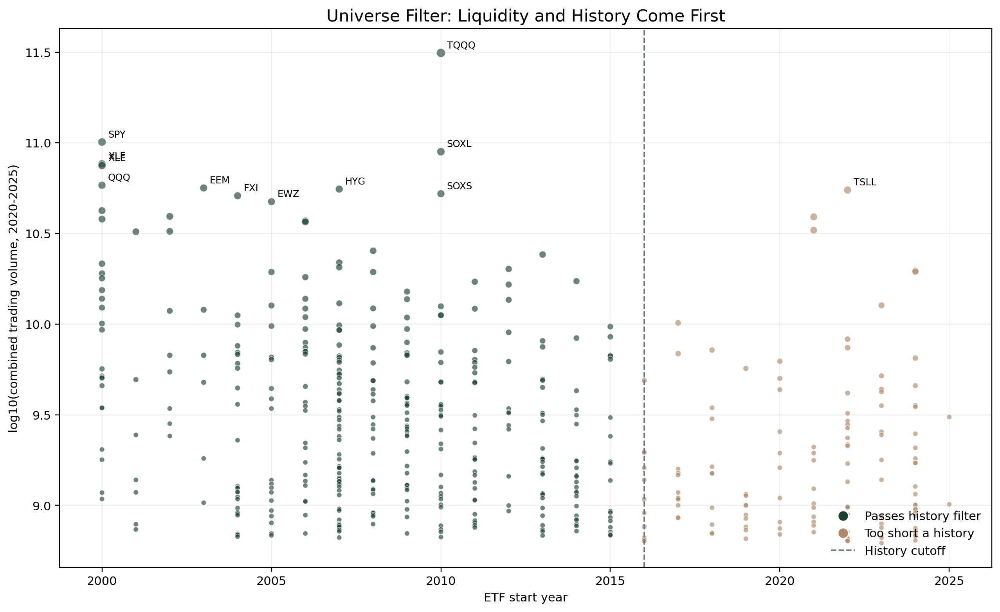
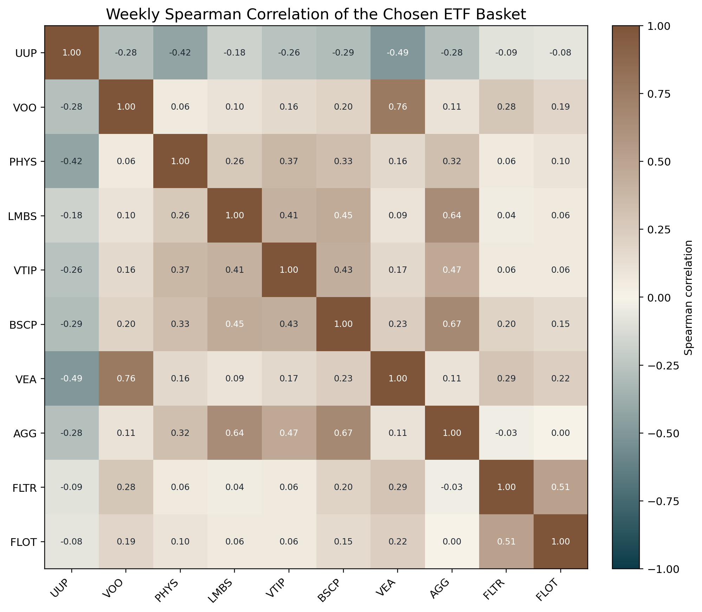
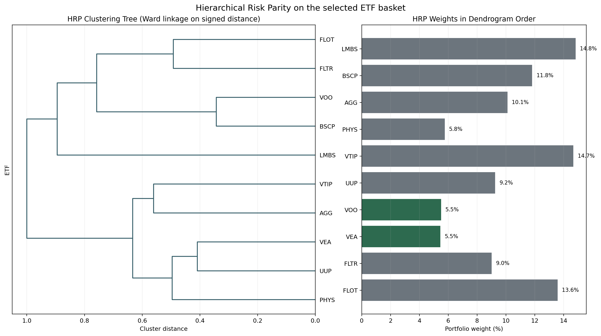

# How I Construct My Own ETF Portfolio

This starts with a practical portfolio construction problem. Start with a
set of ETF return histories and build a basket that is not just a pile of
near-duplicates.

The purpose is straightforward: build an ETF portfolio for personal or trading
accounts that is meant to be held for the long term, not traded as a fast
rotation system.

At a high level, the pipeline is only two steps:

1. First, select a group of ETFs with low correlation to each other.
2. Second, run portfolio optimization to decide the weights.

The process has separate stages:

1. Start from a large liquid ETF universe with long trading history.
2. Build diversified baskets from correlation structure.
3. Compute portfolio weights for a fixed basket.

That separation matters because there are two different questions. The
selection layer asks which ETFs belong together in a diversified basket. The
weighting layer asks how capital should be split once that basket is fixed.

## Start from the part of the ETF universe you would actually trade

The operational details of database access are not the point here, but
the starting filter does matter. I do not run correlation clustering on the
entire ETF space. The workflow first narrows the universe to a few hundred ETFs
with high trading volume and long enough history to be usable for a long-term
portfolio.

In practice, that begins with a liquidity screen on the ETF universe,
followed by a start-date filter before the correlation methods run. The point
is practical rather than academic: if an ETF is too illiquid or too short-lived
to trust in a personal or trading account, it should not even enter the
selection contest.

Once that universe is fixed, the rest of the pipeline works off one shared
daily dataset. That common input matters because it keeps the selection methods
and the weighting methods comparable.



This figure makes the first screen visible. The point is not to search the
entire ETF menu. The point is to start from the part of the ETF universe that
is liquid enough and old enough to be credible for a long-term portfolio.

## From daily prices to a diversification metric

Let $P_t$ be the close price on trading day $t$. Let $r_t$ be the daily log
return from day $t-1$ to day $t$. I compute:

$$
r_t = \ln\left(\frac{P_t}{P_{t-1}}\right)
$$

For two ETFs $i$ and $j$, let $\rho_{ij}$ be the Spearman rank correlation of
their return series. I then convert correlation into signed
distance:

$$
D_{ij} = \sqrt{0.5 \cdot \left(1 - \rho_{ij}\right)}
$$

This design choice is the core of the selection stage. If two ETFs move almost
identically, then $\rho_{ij}$ is close to $1$ and the distance is close to
$0$. If they move against each other, then $\rho_{ij}$ falls and the distance
gets larger. That is exactly what a diversification search should want.

I also tested return-frequency choices here. The setup supports both
daily and weekly returns, and I discussed that trade-off explicitly while
working on the selection process. For long-term ETF selection, I did not use
intraday data even though the broader data pipeline has access to it. Intraday data
is too noisy for this horizon, and the feature-engineering style "as-of" logic
belongs to a different research problem. The working selection setup is
set to `RETURN_FREQUENCY = "weekly"` for that reason.

## The selection is anchored, not free-form

One design decision matters more than it might seem at first:
ETF selection is anchored on `VOO` and `VEA`.

That anchor choice was not presented to the code as an objective truth. It was
a subjective judgment call. I decided to keep one U.S. equity anchor and one
developed ex-U.S. equity anchor, then asked the selection methods to diversify
around those two names.

That means this is not searching for an unconstrained basket from
scratch. It starts from a required U.S. equity anchor and a required developed
ex-U.S. equity anchor, then fills the remaining slots with ETFs that add
distance from that base. In other words, the question is not "What are the ten
most diverse ETFs in the dataset?" It is "Given this equity core, what else
actually diversifies it?"

In the greedy selector, that constraint is explicit:

```python
anchors = anchor_tickers if anchor_tickers is not None else utils.get_anchor_tickers()
anchor_tickers_resolved = utils.ensure_anchor_tickers(
    symbols, "greedy maximin survivors", anchors
)
seed_tickers = anchor_tickers_resolved[:n_select]
selected_idx = [sym_to_idx[ticker] for ticker in seed_tickers]
selected_tickers = seed_tickers.copy()
```

This anchor-first design makes the selected baskets easier to interpret. It
also makes the methods more practical for a real portfolio process, because
it is not pretending that a diversified ETF basket should ignore the
core exposures an investor already expects to keep.

There is another subjective layer here too: blacklist management. The working
selection setup does not simply accept every statistically eligible ETF. It manually excludes a
meaningful list of names, including `GLD`, `ASHR`, `ELV`, `KSA`, `EWZ`, `UGL`,
`VNM`, `ECH`, `BAR`, `SGOL`, `PHYS`, `OUNZ`, and `GDXJ`. That is not a purely
algorithmic step. It is an explicit judgment that some ETFs should not compete
for the final basket even if they survive the basic return and volatility
filters.

That blacklist has to act before clustering and selection. If I do not block
those tickers at the first step, they repeatedly show up in the correlation
clusters and in the final candidate lists. The issue is not that the methods
fail mathematically. The issue is that the methods keep surfacing ETFs I do not
want to hold capital in. So the correct place to exclude them is before the
selection methods start voting.

In practice, that makes the workflow semi-systematic rather than fully
automatic. The methods generate diversified candidates, but the research
process still applies human judgment to the anchor set and to the list of
tickers that should stay out.

## How the greedy selector actually adds names

One of the four selection methods is greedy maximin. Let $S$ be the current
selected set. For any remaining candidate $c$, the method looks at the minimum
distance from $c$ to the names already in $S$. It then adds the candidate with
the largest such minimum:

$$
c^* = \arg\max_{c \notin S} \min_{s \in S} D(c, s)
$$

After the anchors are fixed, the implementation keeps a running vector of
current minimum distances, so each step only needs one update against the
newly added ETF:

```python
min_dist_masked = min_dist.copy()
min_dist_masked[selected_idx] = -np.inf
best_val = min_dist_masked.max()
tied_indices = np.where(np.abs(min_dist_masked - best_val) < 1e-12)[0].tolist()
next_idx = max(tied_indices, key=lambda i: vol_map.get(symbols[i], 0.0))
min_dist = np.minimum(min_dist, D[:, next_idx])
```

This is a good example of why the method is useful in research. The
idea is mathematically clean, but the implementation also handles the details
that matter in practice: fixed anchors, tie-breaking by liquidity, and a
stored marginal-diversity curve that shows when extra names stop adding much.

## What the correlation stage is really doing

The correlation stage is not trying to maximize Sharpe ratio or forecast total
return. It is trying to answer a narrower structural question: which ETFs keep
appearing as distinct exposures after I apply the practical constraints I care
about.

The `merged` view is still useful conceptually even without plotting it. The
saved file `selected_merged.csv` records whether each ETF was chosen by Ward,
greedy, k-medoids, and max-div, then counts how many methods selected it
through the `method_count` column. That gives a simple summary of which names
keep surviving across different correlation-based selectors.

That matters for the blacklist discussion. The final keep-or-drop decisions are
not just driven by one algorithm. The process combines subjective judgment
about anchors and blacklist names with a cross-method voting view of what
repeatedly survives. Put differently, the final practical shortlist is shaped
by both human intervention and agreement across multiple selection methods.

That is also why I do not want this section to lean on Sharpe ratio and similar
metrics in the selection section. At this stage, a high-return ETF can still be
the wrong candidate if it keeps crowding the same cluster, and a low-correlation
ETF can still be the wrong candidate if I do not want to own it in the first
place.



This heatmap is the image I want for the low-correlation step. It shows the
weekly Spearman correlation structure of the chosen basket directly. The goal
is not to find assets that look different by label. The goal is to find assets
that do not keep moving together once they are reduced to returns.

## Where HRP fits in the weighting layer

The selection section above is intentionally about shortlist construction.
Hierarchical Risk Parity, or HRP, enters only after that shortlist already
exists. This is the weighting method I want to show, because it matches the
spirit of the selection stage better than a pure mean-variance optimizer.

HRP uses the clustering structure of the return panel to split capital
recursively across branches of the correlation tree, rather than relying on a
direct covariance-matrix inverse. That matters because covariance inversion can
be fragile when the basket is small and the assets are still meaningfully
correlated.

That makes HRP useful when the basket is small, correlated, and numerically
messy, which is exactly the environment many ETF baskets live in. The method
does the standard sequence: build a Spearman correlation matrix,
convert it to the same signed distance used elsewhere, create a Ward linkage
tree, and then allocate by recursive bisection.

```python
dist = np.sqrt(0.5 * (1.0 - corr))
condensed = squareform(dist, checks=False)
linkage_matrix = linkage(condensed, method="ward")
leaf_order = leaves_list(linkage_matrix).tolist()
```

There are two useful mathematical pieces inside HRP.

First, within a cluster $C$, the method estimates cluster risk by forming an
inverse-variance portfolio on that cluster. If $\Sigma_C$ is the covariance
matrix of the assets inside cluster $C$, and if $\sigma_i^2$ is the variance of
asset $i$, then the inverse-variance weights inside the cluster are:

$$
w_i^{\mathrm{IVP}} = \frac{1 / \sigma_i^2}{\sum_{j \in C} 1 / \sigma_j^2}
$$

The cluster variance is then:

$$
\mathrm{Var}(C) = \left(w^{\mathrm{IVP}}\right)^\top \Sigma_C w^{\mathrm{IVP}}
$$

Second, when a parent cluster is split into a left branch $L$ and a right
branch $R$, HRP allocates more capital to the lower-variance branch. In this
implementation, the left-branch allocation is:

$$
\alpha_L = 1 - \frac{\mathrm{Var}(L)}{\mathrm{Var}(L) + \mathrm{Var}(R)}
= \frac{\mathrm{Var}(R)}{\mathrm{Var}(L) + \mathrm{Var}(R)}
$$

and the right branch gets $\alpha_R = 1 - \alpha_L$. That split is then
applied recursively until the tree reaches single ETFs.

```python
var_left, var_right = cluster_var(left), cluster_var(right)
total = var_left + var_right
alpha = (1.0 - var_left / total) if total > 0 else 0.5
```

The practical reason to use HRP here is not that it guarantees the highest
return. It is that it keeps the weighting stage aligned with the same
dependence logic used in selection. First the ETF set is chosen by how far
apart they are in correlation space, then uses a weighting method that also
respects that hierarchical co-movement structure.



This figure is a better HRP visualization than a plain weight bar chart because
it shows both objects the method actually uses. The left side is the clustering
tree. The right side is the final HRP weight vector in dendrogram order. That
makes it easier to see that HRP is not just assigning weights asset by asset.
It is allocating capital branch by branch, then propagating those decisions
down the hierarchy.

## References

- Charles Spearman, “The Proof and Measurement of Association Between Two Things,” *The American Journal of Psychology*, 15(1), 72-101, 1904. [DOI](https://doi.org/10.2307/1412159)
- Joe H. Ward Jr., “Hierarchical Grouping to Optimize an Objective Function,” *Journal of the American Statistical Association*, 58(301), 236-244, 1963. [DOI](https://doi.org/10.1080/01621459.1963.10500845)
- Marcos López de Prado, “Building Diversified Portfolios that Outperform Out-of-Sample,” *The Journal of Portfolio Management*, 42(4), 59-69, 2016. [SSRN](https://papers.ssrn.com/sol3/papers.cfm?abstract_id=2708678)
- Yves Choueifaty and Yves Coignard, “Toward Maximum Diversification,” *The Journal of Portfolio Management*, 35(1), 40-51, 2008. [DOI](https://doi.org/10.3905/JPM.2008.35.1.40)
